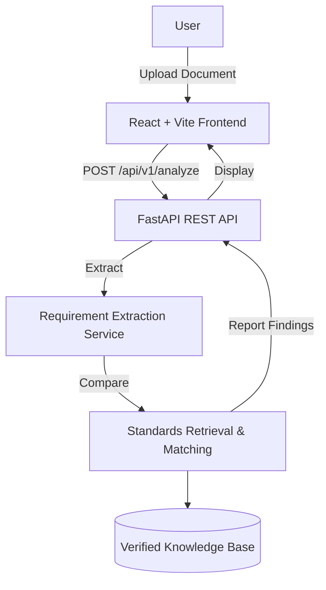

# Bharat Standards AI

AI-Powered Recommendation Engine for identifying applicable Indian Standards (IS) for procurement specifications.

## Overview
Procuring goods that meet national standards is critical but complex. Bharat Standards AI automates the analysis of procurement documents, extracting key requirements and mapping them against a verified Indian Standards knowledge base. The system delivers explainable, evidence-backed recommendations, reducing manual review time and ensuring better compliance.

---

## The Problem
- **Specification Complexity:** Procurement documents contain varied technical, safety, material, and environmental requirements.
- **Manual Oversight:** Manually locating applicable standards in thousands of BIS-published documents is slow and error-prone.
- **Traceability:** It is difficult to maintain clear evidence linking a specific requirement to a technical standard and regulatory requirement (QCO status).

## The Solution
Bharat Standards AI follows a structured analysis pipeline:
1. **Requirement Extraction:** Parses procurement text (LLM-driven with regex-based deterministic fallback) to structure requirements.
2. **Standards Retrieval:** Uses hybrid search (Lexical + Semantic) against a verified standards knowledge base.
3. **Relevance Ranking:** Reranks candidates based on deep requirement signals.
4. **Evidence Mapping:** Provides source citations (BIS links) for each recommendation.
5. **Report Generation:** Generates comprehensive, compliant-ready analysis reports.

---

## Key Features
*   **Intelligent Extraction:** Automated parsing of procurement specifications.
*   **Hybrid Standards Search:** Kombines lexical and semantic approaches for high-precision retrieval.
*   **Explainable Recommendations:** Provides the "why" behind each standard suggestion, backed by evidence text.
*   **Compliance Awareness:** Identifies regulatory QCO status (conservative lookup).
*   **Traceability:** Cites specific evidence text and source URLs (BIS official sources).
*   **Report Generation:** Exports findings into structured analysis reports.

> **Note:** Compliance information is presented conservatively. Absence of a QCO record does not definitively imply a product is exempt from regulatory requirements.

---

## System Architecture



---

## Technology Stack

| Domain | Technologies |
| :--- | :--- |
| **Frontend** | React, TypeScript, Vite, CSS |
| **Backend** | Python, FastAPI, Uvicorn, Pydantic |
| **Search/AI** | Sentence-Transformers, FAISS, LLM (Gemini/OpenAI), Regex Fallback |
| **Processing** | PyMuPDF, python-docx |
| **Testing** | pytest |

---

## Project Structure
```text
bharat-standards-ai/
├── backend/            # FastAPI Application & Analysis Services
│   ├── app/            # Core logic (routes, services, schemas)
│   ├── data/           # Structured standards knowledge base
│   ├── tests/          # pytest suites
│   └── requirements.txt
├── frontend/           # React + TypeScript Web Dashboard
│   ├── src/            # Components, API calls, and logic
│   └── package.json
└── README.md
```

---

## Getting Started

### Backend
1. Initialize virtual environment:
   ```bash
   cd backend
   python -m venv .venv
   .venv\Scripts\activate  # Windows
   pip install -r requirements.txt
   ```
2. Set up environment: Create a `.env` file (see `.env.example`).
3. Run:
   ```bash
   uvicorn app.main:app --reload
   ```

### Frontend
1. Install dependencies and start:
   ```bash
   cd frontend
   npm install
   npm run dev
   ```

---

*This project is a submission for SIH 2026. Code and datasets are provided for research and prototyping purposes.*
